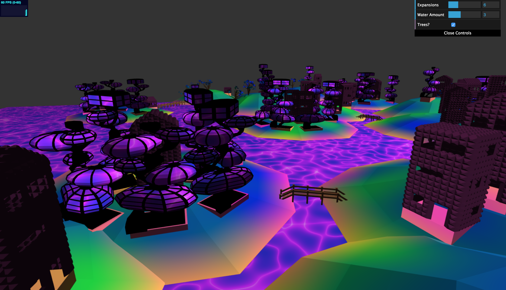
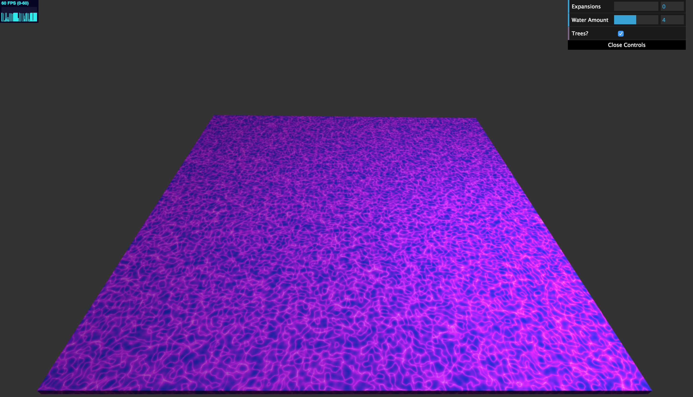
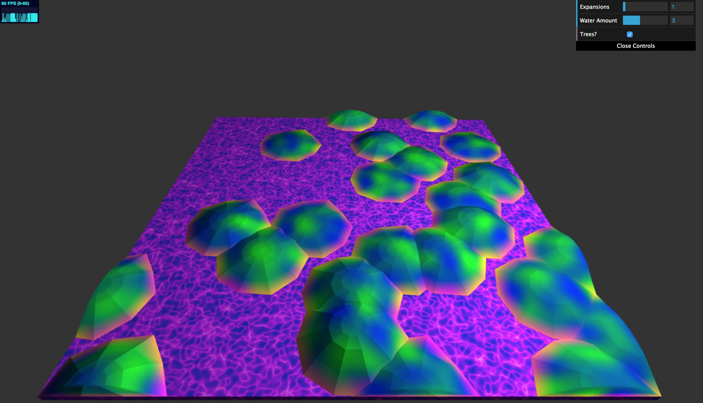
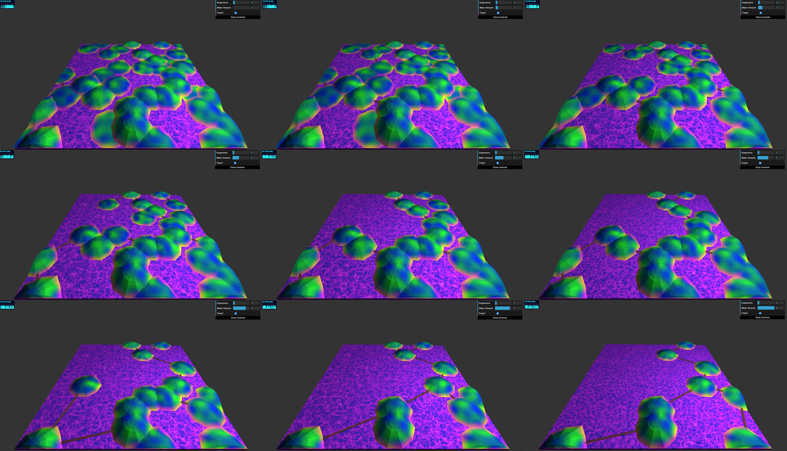
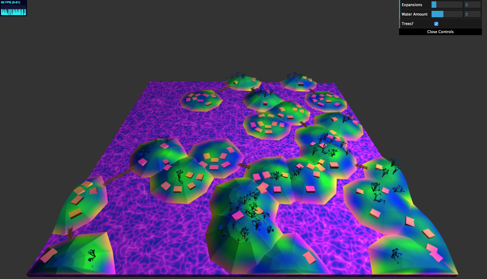
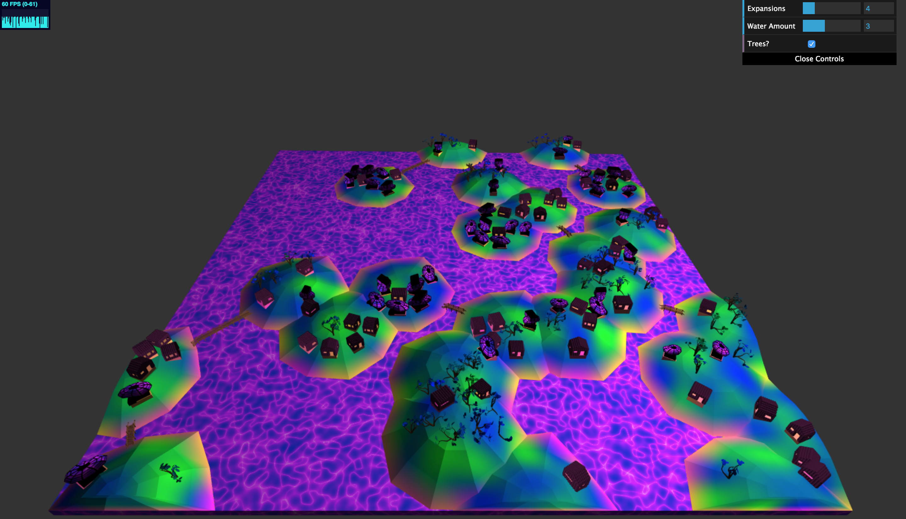
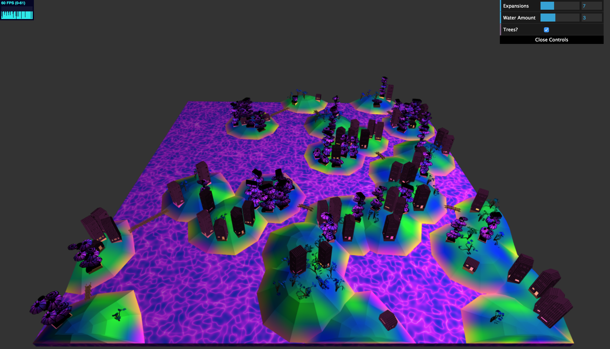
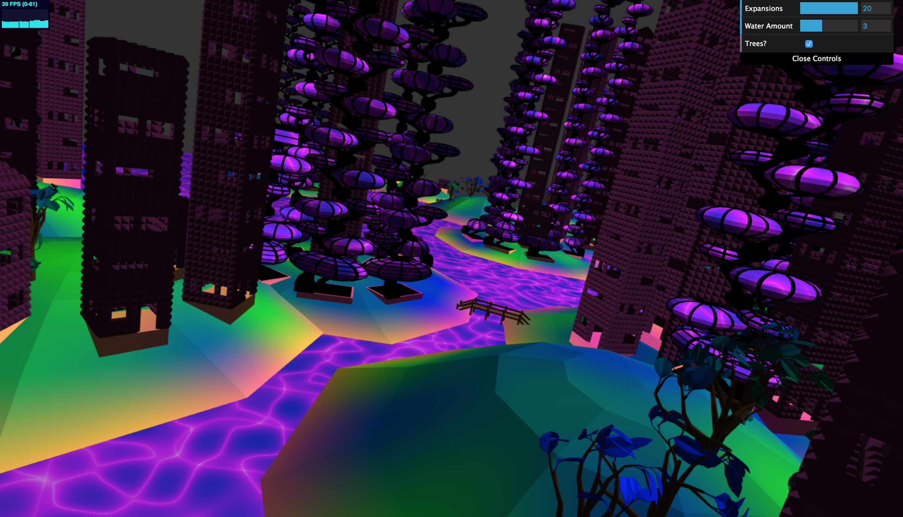

# Project 5: Shape Grammar

Name: Alexis Ward

PennKey: aleward

Demo Link: [here](https://aleward.github.io/shape-grammar-city-aleward/)

## MY CITY
Welcome! Today we explore the history of my city. Surrounded by a mysterious goop that no local seems bothered by (except for its possible influence on their strange taste in architecture), it is a hilly paradise filled with an amalgamation of structures they call home  - all manufactured by yours truly on Maya.

With The Initial Grammar, there was nothing but goop in sight.

Then came The First Expansion; miraculously, land began to rise from the goop.

During The Second Expansion, people built bridges throughout the land in order to travel, however none have yet to settle down.

The toggle bar floating on the side of our world allows you to explore alternate realities where our water levels differ. Our MST algorithm always ensures we have the most efficient bridge structure. For clarity in this walkthrough, however, we'll stick to Water Amount 3.

The Third occurs, and people begin to realize how great residing alongside goop is. They build the foundation to their houses, making sure not to work over trees, and they're more likely to reside on the flatter plains for ease of construction (and also less trees). They based their logic off of noise to keep things consistent.

With The Fourth Expansion, the residents are fairly settled in, and decided on two main architectural styles. The building style consisting of odd orbs can be slightly fickle, so, for safety, the residents were more inclined to build those on the flatter surfaces.

As more Expansions come along, more people move into our weird little town. To accommodate, the buildings are extended upwards. Each floor is rotated from the previous, and the buildings that had roofs retain them.

Who knows? One day our city may even expand to a monstrosity like this! Feel free to experiment with our simulation, linked above, to explore the possibilities.

## GRAMMAR
### Expansions:
The contents of each array below are determined by the input parameters.

Until an array's length is 1, each expansion uses the pop() function to get the correct string.

(Take "..." to mean an indefinite amount of these characters, not an actual element to the grammar)

* "W"  ->  ["W", "WLLL..."]
* "L"  ->  ["L", "L[UG]", "L[UG]", ...]
* "B"  ->  can be [ ] or ["(-...)", ...], presense of "-" not guaranteed
* "("  ->  ["("]
* ")"  ->  [")"]
* "-"  ->  ["-"]
* "U"  ->  ["[[<h=]+[<h=]+[<h=]+[<h=]+[<h=]+[<h=]+[<h=]+[<h=]+[<h=]]"]
* "G"  ->  ["[[<<h=]* [<<h=]* [<<h=]* [<<h=]* [<<h=]* [<<h=]* [<<h=]* [<<h=]* [<<h=]]"]
* "="  ->  ["r"]
* "h"  ->  ["hs"]
* "s"  ->  ["s"]
* "r"  ->  ["r"]
* "<"  ->  ["<"]
* "+"  ->  ["+"]
* "* "  ->  ["* "]
* "["  ->  ["["]
* "]"  ->  ["]"]

### Rules:

* "W"  ->  Draws water block
* "L"  ->  Draws land blobs
* "B"  ->  Marks the existance of a bridge (its expansions signify actual bridge components)
* "("  ->  Adds a new turtle to the stack, computes bridge direction and draws the first staircase to the bridge
* ")"  ->  Draws the ending staircase to the current bridge and removes the last turtle from the stack
* "-"  ->  Draws each walkway component of a bridge
* "U"  ->  Marks the first ring of possible houses on a land blob
* "G"  ->  Marks the second ring of possible houses on a land blob
* "="  ->  Marks the possibility of a roof
* "h"  ->  Decides whether a house or tree is drawn in the present location. (If a house, draw the foundation, if a tree, draw the tree)
* "s"  ->  Draws each story of a house - shape varies per house type (blocky house vs cool house) and per story type (ground floor vs middle floor)
* "r"  ->  May or may not draw a roof
* "<"  ->  Shifts turtle position outward (Z-direction)
* "+"  ->  Rotates turtle around Y-axis 72 degrees
* "* "  ->  Rotates turtle around Y-axis 40 degrees
* "["  ->  Creates new turtle state
* "]"  ->  Restores previous turtle state

## Instructions
For this assignment you'll be building directly off of the L-system code you
wrote last week.

**Goal:** to model an urban environment using a shape grammar.

**Note:** We’re well aware that a nice-looking procedural city is a lot of work for a single week. Focus on designing a nice building grammar. The city layout strategies outlined in class (the extended l-systems) are complex and not expected. We will be satisfied with something reasonably simple, just not a uniform grid!

## Symbol Node (5 points)
Modify your symbol node class to include attributes necessary for rendering, such as
- Associated geometry instance
- Position
- Scale
- Anything else you may need

## Grammar design (55 points)
- Design at least five shape grammar rules for producing procedural buildings. Your buildings should vary in geometry and decorative features (beyond just differently-scaled cubes!). At least some of your rules should create child geometry that is in some way dependent on its parent’s state. (20 points)
    - Eg. A building may be subdivided along the x, y, or z axis into two smaller buildings
    - Some of your rules must be designed to use some property about its location. (10 points)
    - Your grammar should have some element of variation so your buildings are non-deterministic.  Eg. your buildings sometimes subdivide along the x axis, and sometimes the y. (10 points)   
- Write a renderer that will interpret the results of your shape grammar parser and adds the appropriate geometry to your scene for each symbol in your set. (10 points)

## Create a city (30 points)
- Add a ground plane or some other base terrain to your scene (0 points, come on now)
- Using any strategy you’d like, procedurally generate features that demarcate your city into different areas in an interesting and plausible way (Just a uniform grid is neither interesting nor plausible). (20 points)
    - Suggestions: roads, rivers, lakes, parks, high-population density
    - Note, these features don’t have to be directly visible, like high-population density, but they should somehow be visible in the appearance or arrangement of your buildings. Eg. High population density is more likely to generate taller buildings
- Generate buildings throughout your city, using information about your city’s features. Color your buildings with a method that uses some aspect of its state. Eg. Color buildings by height, by population density, by number of rules used to generate it. (5 points)
- Document your grammar rules and general approach in the readme. (5 points)
- ???
- Profit.

## Make it interesting (10)
Experiment! Make your city a work of art.

## Warnings:
If you're not careful with how many draw calls you make in a single `tick()`,
you can very easily blow up your CPU with this assignment. As with the L-system,
try to group geometry into one VBO so the run-time of your program outside of
the time spent generating the city is fast.

## Suggestions for the overachievers:
Go for a very high level of decorative detail!
Place buildings with a strategy such that buildings have doors and windows that are always accessible.
Generate buildings with coherent interiors
If dividing your city into lots, generate odd-shaped lots and create building meshes that match their shape .i.e. rather than working with cubes, extrude upwards from the building footprints you find to generate a starting mesh to subdivide rather than starting with platonic geometry.
